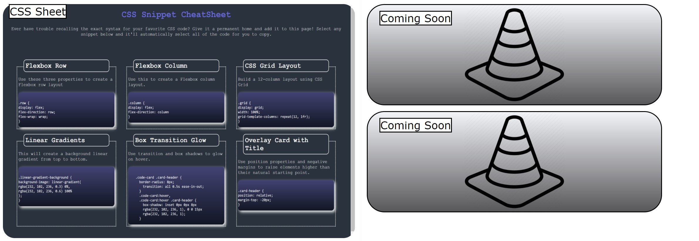

# my-portfolio

## Description
The following is a project intended to utilize both HTML and CSS in order to create a webpage. Now the webpage itself includes information about myself, projects, and ways to contact me. In a sense it is an online portfolio that displays my skills in web development. With this project came a set criteria, down below will be a list of said criteria. 

* Name, photo, links to sections
* UI scroll capabilities
* Titled images of applicaitons
* First application's image is larger than others
* Links to deployed applications
* Responisive layout that adapts to viewport

### Technologies:
Down below will be necessary tech needed in order to run the files:

* windows 10 or equivalent operating system
* IDE capable of running HTML and CSS
* Web browser
* (recommended: Git Bash, VS Code, Chrome browser)

### Installation
Steps to download and run application:
* Fork the repository and clone through terminal
* Open file in IDE 
* Open the file in Web browser to view

### Walkthrough the application
When looking at the application there is a navigation in the top right corner of the page. This allows the user to instantly jump to a desired section without scrolling. The first section will include a short intro. Then a view into my recent project. Now there is currently only one application up, but more are coming soon. When you click on the image of the project it will direct you to the application for viewing. Below the project section is the About Me section including details about myself, and the contact section with my contact information. Small note there is also a link to my GitHub located in the contact section. 

### Link
https://rich-f-p.github.io/my-portfolio/

The following is what the project section currently looks like:

#### Code
* HTML
* CSS
